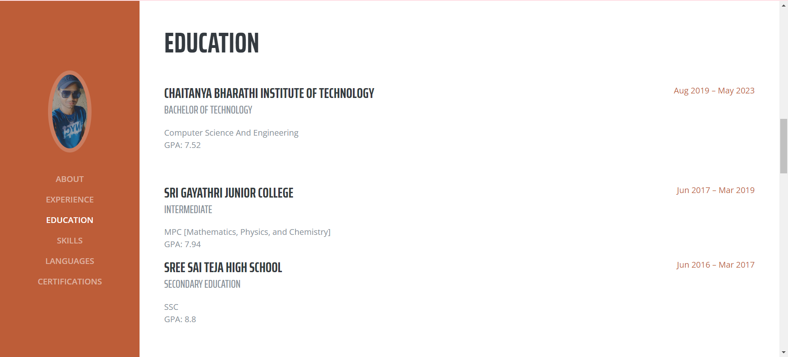

<!-- Portfolio Section -->
<section class="resume-section p-3 p-lg-5 d-flex flex-column" id="portfolio">
    

        <h2 class="mb-5">Portfolio</h2>

        

            <h3>About</h3>
            
        

        

            <h3>Experience</h3>
            
        

        

            <h3>Education</h3>
            
        

        

            <h3>Skills</h3>
            
        

        

            <h3>Languages</h3>
            
        

        

            <h3>Certifications</h3>
            
        

        
Here I am attaching the final working website's portfolio photos for reference.

    

</section>
